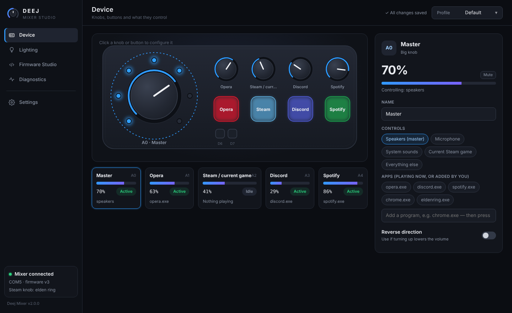
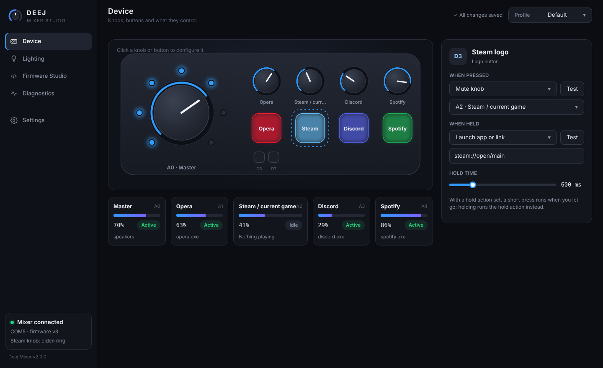
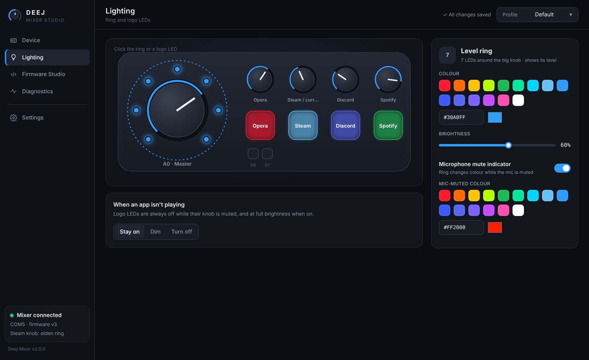
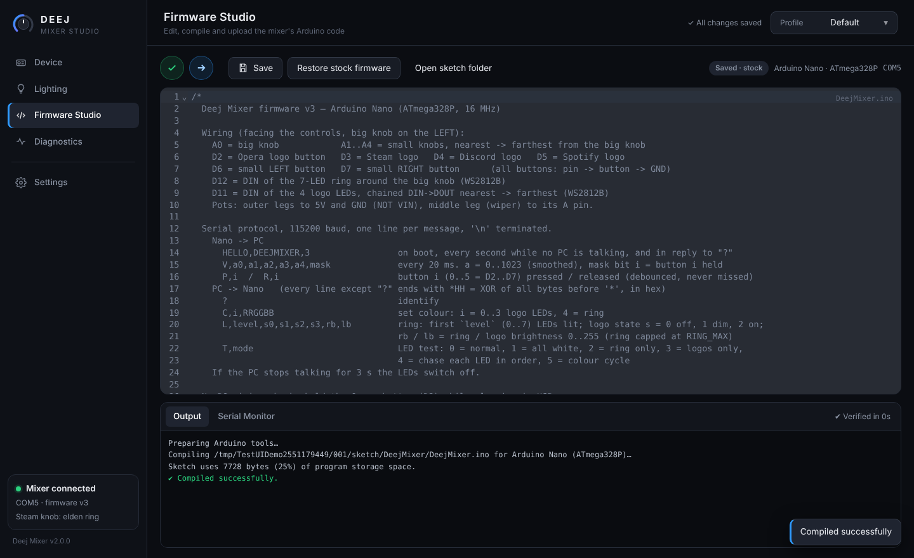
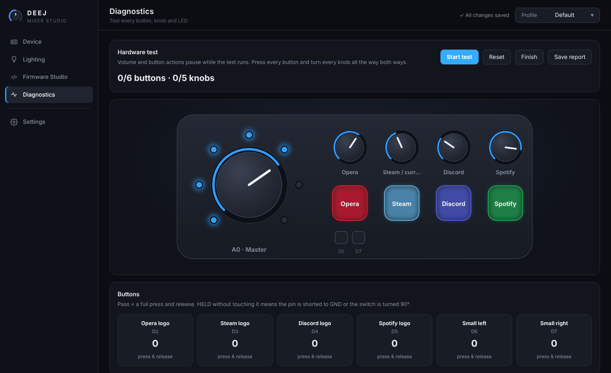

<p align="center">
  
</p>

<h1 align="center">Deej Mixer Studio</h1>

<p align="center">
  A five-knob, six-button USB desk mixer for Windows, with an LED level ring, per-app volume, macro buttons and a built-in Arduino firmware editor.<br>
  A fork and reimagining of <a href="https://github.com/omriharel/deej">deej</a>, built for the <a href="https://www.printables.com/model/867600">deej enclosure on Printables</a>.
</p>

<p align="center">
  <a href="../../releases/latest"><b>Download for Windows</b></a> ·
  <a href="#hardware">Build the hardware</a> ·
  <a href="#building-from-source">Build from source</a>
</p>

---

## Features

| | |
|---|---|
| 🎚️ **Per-app volume** | Five knobs, each bound to the speakers, the microphone, system sounds, any app (`spotify.exe`), several apps, or **everything else**. |
| 🎮 **Steam game knob** | Follows whichever game you launched last from your Steam library, falling back to the Steam client. Non-Steam games can be added by exe name. |
| 🔘 **Programmable buttons** | Six buttons, each with a **press** and a **hold** action: mute a knob, mute the mic, launch an app or link, send a keyboard shortcut, or play/pause, next and previous track. |
| 💡 **Lighting that means something** | A 7-LED ring shows the big knob's level, and logo LEDs turn off when their app is muted. The ring changes colour while your mic is muted. You choose every colour. |
| 🧩 **Profiles** | Keep separate setups (Gaming, Work, Streaming…) and switch from the title bar. |
| 🛠️ **Firmware Studio** | An Arduino-IDE-style editor inside the app. Edit the mixer's code, then **Verify**, **Upload** and use the serial monitor without opening another program. |
| 🩺 **Diagnostics** | A live hardware test that shows every button, knob and LED passing or failing. It catches shorted buttons, loose wipers and wrong LED order. |
| ⚙️ **Proper install** | One installer adds the app, a Start-menu entry and the CH340 USB driver to Windows' driver store, plus optional start-with-Windows. |

<p align="center">
  
  
  
  
</p>

## Install

1. Download **`DeejMixer-Setup-x.y.z.exe`** from [Releases](../../releases/latest) and run it.
   Windows SmartScreen may warn about an unknown publisher. Click *More info → Run anyway*.
2. Plug in the mixer. Windows loads the USB driver automatically, and the app finds the mixer by itself.
3. If the mixer is new, open **Settings → Upload stock firmware** (or **Firmware Studio → Upload**).

Silent install: `DeejMixer-Setup-x.y.z.exe /S`. A portable zip is also attached to each release.

## Hardware

| Part | Qty |
|---|---|
| Arduino Nano (ATmega328P, CH340 or FT232 USB) | 1 |
| 10 kΩ linear potentiometer (one large knob, four small) | 5 |
| Tactile push button (4 large logo buttons, 2 small) | 6 |
| WS2812B LEDs: 7 for the ring, 4 for the logo buttons | 11 |
| 330–470 Ω resistor (one per LED data line) | 2 |
| 100–470 µF electrolytic capacitor across LED 5V/GND (recommended) | 1 |

### Wiring

Facing the mixer with the big knob on the **left**:

| Nano pin | Connects to |
|---|---|
| **A0** | Big knob wiper |
| **A1 → A4** | Small knob wipers, from nearest to farthest from the big knob |
| **D2 / D3 / D4 / D5** | Logo buttons: Opera / Steam / Discord / Spotify |
| **D6 / D7** | Small left / small right button (under the first logo) |
| **D12** | DIN of the 7-LED ring (via the resistor) |
| **D11** | DIN of the 4 logo LEDs, chained DIN→DOUT from nearest to farthest (via the resistor) |
| **5V / GND** | Pot outer legs, LED power and button ground |

> [!IMPORTANT]
> * Buttons go between their pin and **GND**; the firmware turns on the internal pull-ups. On 4-leg tactile switches, use **diagonally opposite legs**. Same-side legs are always connected, and the button will read as permanently pressed.
> * Pots: outer legs to **5V** and **GND** (not **VIN**, which has no power on USB), middle leg to the A pin. If a knob reads backwards, tick *Reverse* in the app.
> * Firmware caps the ring at 160/255 brightness so all 11 LEDs stay within USB power.

**No-PC wiring check:** hold the Opera button while plugging in USB. The ring follows whichever knob you turn, and each logo LED lights while its button is held.

## How it works

```
 ┌────────── Arduino Nano ──────────┐   USB serial 115200   ┌──────── DeejMixer.exe ─────────┐
 │ pots A0–A4 · buttons D2–D7       │  V,a0..a4,mask (50 Hz)│ engine: Windows Core Audio      │
 │ WS2812B ring D12 · logos D11     │  P,i / R,i  (events)  │ (per-app volume, mute), actions │
 │ firmware/DeejMixer/DeejMixer.ino │ ◀── C / L / T *HH ─── │ UI: WebView2 window + tray      │
 └──────────────────────────────────┘   (checksummed)       └────────────────────────────────┘
```

* **Firmware** (`firmware/`): smoothed pots with hysteresis, debounced button *events* so short taps are never lost, checksummed LED commands, and LEDs that switch off when the PC stops talking. It is tested in the [simavr](https://github.com/buserror/simavr) simulator (`firmware/sim/`).
* **App** (`app/`): Go using only the standard library. It talks to Windows Core Audio, serial ports, the tray, WebView2 and the registry directly through COM/Win32 calls, without cgo or third-party Go modules. Volumes are only set when a knob actually moves, so changes made in the Windows mixer stay put.
* **Protocol** is documented at the top of [`DeejMixer.ino`](firmware/DeejMixer/DeejMixer.ino).

## Building from source

Everything builds on Linux. GitHub Actions runs the same script and attaches the results to each release.

```bash
sudo apt install golang nodejs npm gcc-avr avr-libc arduino-core-avr simavr libsimavr-dev libelf-dev \
                 binutils-mingw-w64-x86-64 nsis zip unzip
./scripts/build-release.sh          # → dist/DeejMixer.exe, DeejMixer-Setup-*.exe, portable zip, firmware .hex
```

The script runs the firmware simulator tests, the app's unit tests (engine, protocol, profiles, Firmware Studio, web security), and an end-to-end test of the app driving the real firmware inside the simulator.

To publish a release, push a tag: `git tag v2.0.1 && git push --tags`.

## Credits

* [deej](https://github.com/omriharel/deej) by Omri Harel, the original open-source volume mixer idea.
* The [deej enclosure on Printables](https://www.printables.com/model/867600), which this hardware layout is built around.
* See [THIRD-PARTY-NOTICES.md](THIRD-PARTY-NOTICES.md) for bundled components (AVRDUDE, Adafruit NeoPixel, WCH driver, CodeMirror).

## License

[MIT](LICENSE) for the code in this repository. Bundled third-party components keep their own licenses.
